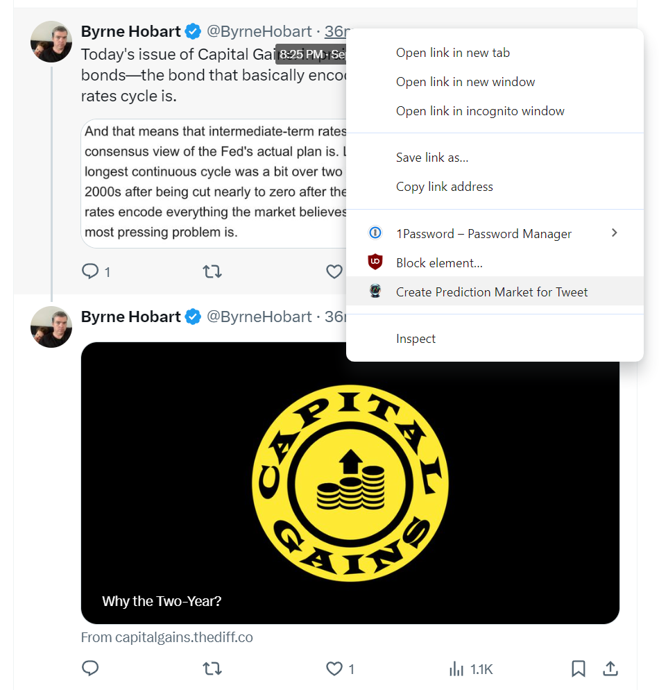
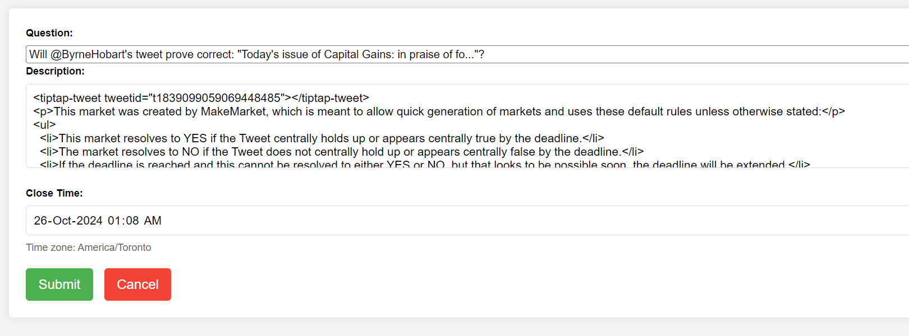
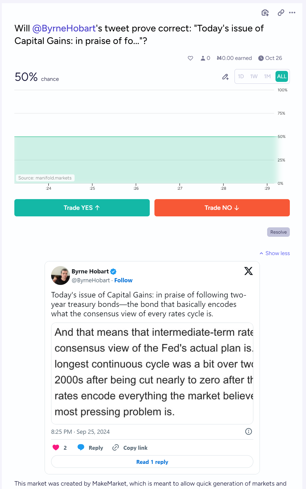

# MakeMarket

A Chrome extension for automatically creating a prediction market from a tweet.

## Setup

1. Create an API key for Manifold Markets.

2. Enter your Manifold Markets API key in the extension options.

## Usage

1. Right-click on the tweet's timestamp (usually shows the date or "X m/h/d").

2. Select "Create Prediction Market for Tweet" from the context menu.
   

3. A new tab will open with a form pre-filled with market details. Review and edit if necessary:
   - Question: The main question for the prediction market
   - Description: Additional context, including the embedded tweet
   - Close Time: When the market will close (default is 30 days from creation)
   

4. Click "Submit" to create the market, or "Cancel" to abort.

5. If successful, a new tab will open with the created market on Manifold Markets.
   

## Default Market Rules

Unless otherwise stated, the following default rules apply to created markets:

- The market resolves to YES if the Tweet centrally holds up or appears centrally true by the deadline.
- The market resolves to NO if the Tweet does not centrally hold up or appears centrally false by the deadline.
- If the deadline is reached and resolution is not possible, but looks to be possible soon, the deadline will be extended.
- If a full YES or NO resolution does not appear possible soon after the deadline, it will resolve to a fair percentage by the market creator's best judgment, defaulting to the market price.
- For popular markets, the creator reserves the right to clarify rules and specify a more robust resolution mechanism adhering to the intent of the market based on the linked Tweet.

## Troubleshooting

- Ensure your Manifold Markets API key is correctly entered in the extension options.
- Check the browser console for any error messages if the market creation fails.

## Contributing

Contributions are welcome! Please feel free to submit a Pull Request.

## License

[MIT License](LICENSE)